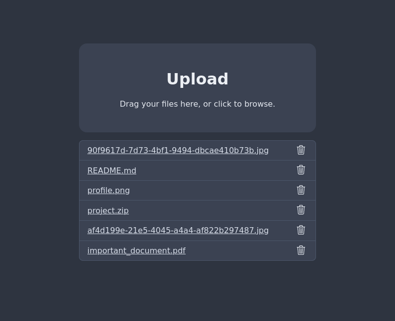
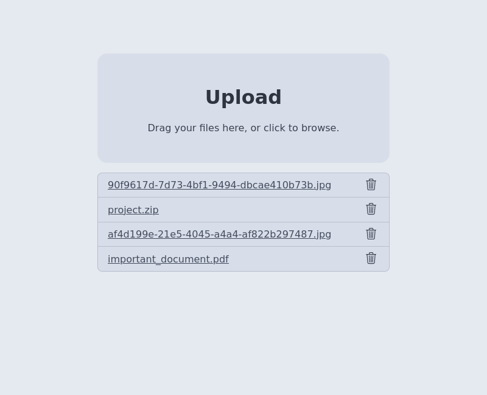

# filestation

Very simple file sharing server written for Deno.

- Upload files via POST
- Delete files via DELETE
- Download files via GET
- List files (can be disabled)

The goal of this project is to be as minimal as possible. There is no
authentication or folder support built in. You can just upload, download and
delete files.

By default a list of available files is sent on `/list`. You can disable this
behaviour by supplying the `--no-list` argument.

## Deploy

Arguments:

- `--port`, `-p`: Specify the port the server will listen on. (default: 3000)
- `--root`, `-r`: The folder where files should be stored / read from. (default:
  `files`)
- `--index`, `-i`: The file that will be sent on requests to `/`, relative to
  the root folder. (default: `index.html`)
- `--block`, `-b`: Files that can't be deleted/uploaded. Can be defined multiple
  times. (default: `index.html`)
- `--verbose`, `-v`: Show additional logging output. (default: false)
- `--list, --no-list`: Enable/disable file listing. When this is enabled it will
  also block files with the name "list" from being uploaded. (default: true)
- `--path`: Basepath if hosted "in a subfolder". (default: `/`)

You can run the file using [Deno](https://deno.land/) but it is recommended to
run via docker.

```sh
# run using deno
deno run -q --allow-net --allow-write=myfolder --allow-read=myfolder src/mod.ts \
  -p 1080 --root myfolder -b mystaticfile -v
```

### Docker

You can build a docker image using the provided [Dockerfile](./Dockerfile).
Clone the repository and run `docker-compose up` to use the default
[compose file](./docker-compose.yml).

The image includes the index file built from
[./web/index.html](./web/index.html). The index file is stored outside of the
root folder to allow mounting a volume for persistent storage.

The docker image uses these arguments:

| Option  | Value                   |
| ------- | ----------------------- |
| port    | 80                      |
| index   | `/app/files/index.html` |
| root    | `/app/files/root`       |
| block   | (none)                  |
| list    | true (default)          |
| verbose | false (default)         |
| path    | `/` (default)           |

You can add your own index file by mounting to `/app/files/index.html` or by
giving a different "command" to docker.

Also see [./examples/docker-compose.yml](./examples/docker-compose.yml) for an
example of a setup behind a reverse proxy.

## Usage

```sh
# upload
curl -F file=@myfile.txt’ filestation.local
# list
curl filestation.local/list
# download
curl filestation.local/myfile.txt
# delete
curl -X DELETE filestation.local/myfile.txt
```

Upload files by sending a POST request which contains a "file" property with the
file. Download a file by seding a GET request to the filpath. Delete a file by
sending a DELETE request to the filepath.

### Web UI

The project in [./web](./web) is a minimal index file which is also used in the
docker container. The page uses the fetch api to allow uploading, deleting and
downloading files (the last two only if the list option is enabled).

<table>
  <tr>
    <td>
      
    </td>
   <td>
      
    </td>
  </tr>
</table>
